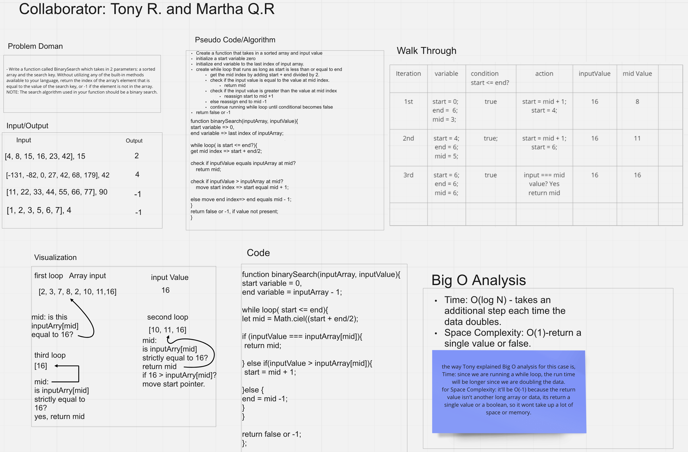

# Array Binary Search

Write a function called BinarySearch which takes in 2 parameters: a sorted array and the search key. Without utilizing any of the built-in methods available to your language, return the index of the array’s element that is equal to the value of the search key, or -1 if the element is not in the array.

## Whiteboard Process

- [whiteboard-link-miro](https://miro.com/app/board/uXjVOlUpZrI=/?share_link_id=865131138273)

## Approach & Efficiency

The approach I took was writing down the stuff I did know and then figuring out the solution first. I know it sounds backwards, but solving it first helps me explain how to solve it. I know it might not be the right way, or it would be simpler to do it the other way around. Collaborated with Tony and it helped talking things through.
