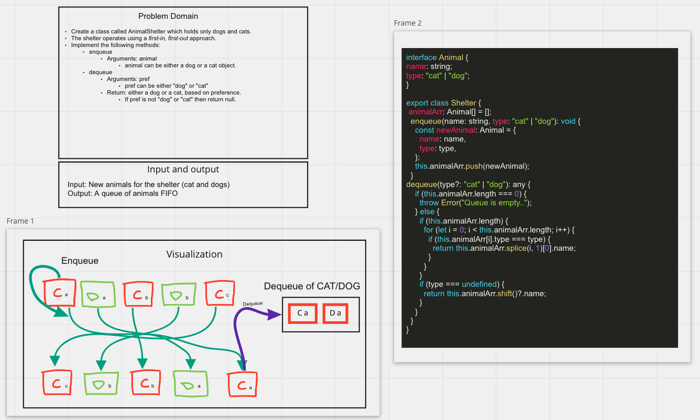

# Challenge Summary

Write code that will enqueue and dequeue animals

## Whiteboard Process
- 

## Approach & Efficiency
<!-- What approach did you take? Why? What is the Big O space/time for this approach? -->

## Solution
<!-- Show how to run your code, and examples of it in action -->
