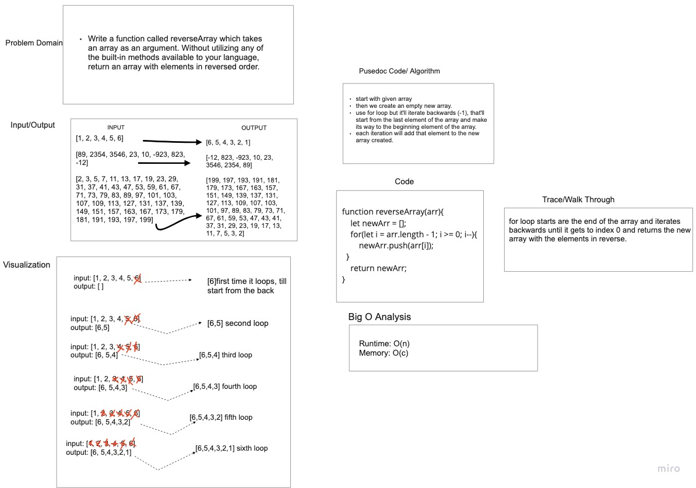

# Reverse an Array
  Write a function called reverseArray which takes an array as an argument. Without utilizing any of the built-in methods available to your language, return an array with elements in reversed order.

## Whiteboard Process

- [whiteboard-link-miro](https://miro.com/app/board/uXjVOmyLIeQ=/?share_link_id=281706561202)

## Approach & Efficiency
The approach I took was writing down the stuff I did know and then figuring out the solution first. I know it sounds backwards, but solving it first helps me explain how to solve it. I know it might not be the right way, or it would be simpler to do it the other way around. And then I followed the Demo that David did.
