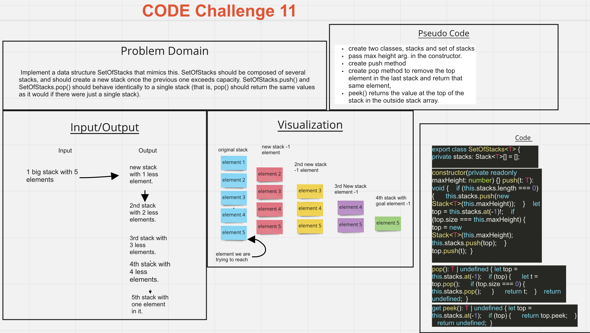

# Set Of Stacks

## Challenge

Imagine a (literal) stack of plates. If the stack gets too high, it might topple. There-fore, in real life, we would likely start a new stack when the previous stack exceeds some threshold. Implement a data structure SetOfStacks that mimics this. SetOfStacks should be composed of several stacks, and should create a new stack once the previous one exceeds capacity. SetOfStacks.push() and SetOfStacks.pop() should behave identically to a single stack (that is, pop() should return the same values as it would if there were just a single stack).

## White Board

## PR Code Challenge 11

- <https://github.com/Marthaquinram/data-structures-and-algorithms-401/pull/19>

## Approach & Efficiency

- Used David's code.

## Collaborators

- David S.
