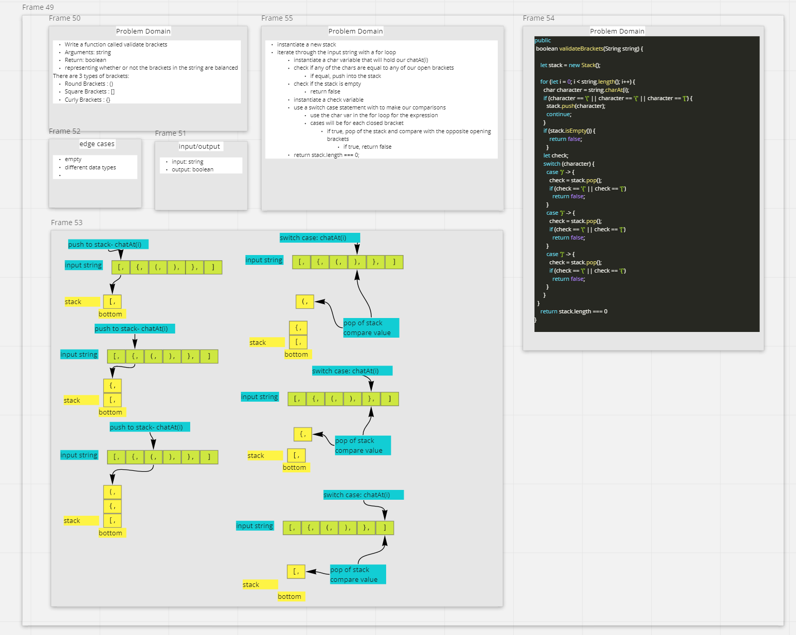

# Multi-bracket Validation
## Challenge

Write a function called validate brackets
Arguments: string
Return: boolean
representing whether or not the brackets in the string are balanced
There are 3 types of brackets:

Round Brackets : ()
Square Brackets : []
Curly Brackets : {}

## White Board

- 

## PR Code Challenge 13

- <https://github.com/Marthaquinram/data-structures-and-algorithms-401/pull/24>

## Approach & Efficiency

- Did code challenge review during class, we knew we needed to iterate through a stack and compare values.

## Collaborators

- Tony R.
