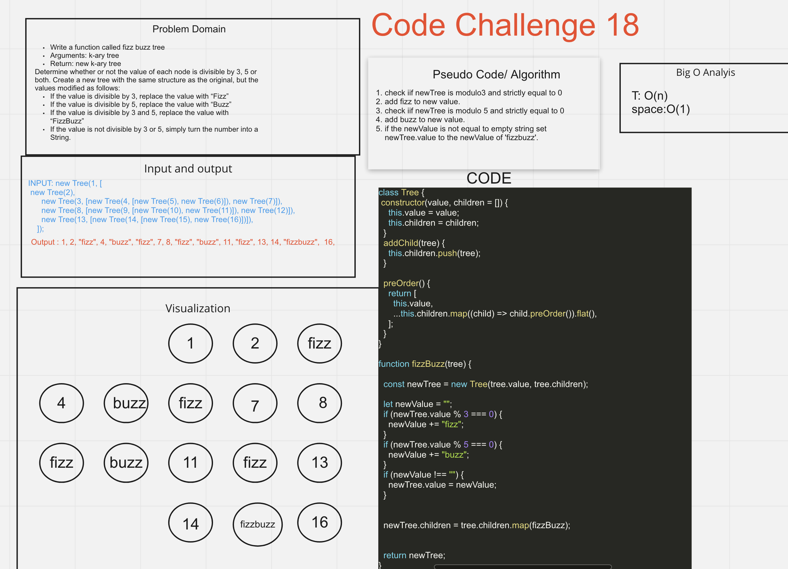

# Trees

A tree is a collection of nodes connected by some edges. A tree is a non linear data structure. A Binary Search tree is a binary tree in which nodes that have lesser value are stored on the left while the nodes with a higher value are stored at the right. - [geeksforgeeks] <https://www.geeksforgeeks.org/implementation-binary-search-tree-javascript/>

## Challenge

CC18 - Write a function called fizz buzz tree
Arguments: k-ary tree
Return: new k-ary tree
Determine whether or not the value of each node is divisible by 3, 5 or both. Create a new tree with the same structure as the original, but the values modified as follows:

If the value is divisible by 3, replace the value with “Fizz”
If the value is divisible by 5, replace the value with “Buzz”
If the value is divisible by 3 and 5, replace the value with “FizzBuzz”
If the value is not divisible by 3 or 5, simply turn the number into a String.

## Approach & Efficiency

- I had to understand what was happening first and then worked with team to code it and used resources from google.
Speaking with Tony helped me get a better understanding of how the BST and BT are working, seeing it visually makes sense.

## Whiteboard

## Starting up

To run the test, do npm test fizzbuzz.test.js

## Collaborators

- Danny C. and Sarah, and popcorn from class review.
